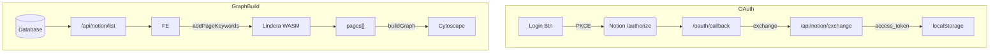

# AGENTS.md – System Instructions for LLM Agents

These guidelines are **autoloaded** when an autonomous agent/LLM opens this repository. They ensure every agent writes code and documentation that seamlessly fits the existing architecture.

Read more detail in [./docs/ARCHITECTURE.md](./docs/ARCHITECTURE.md).

## 0. TL;DR

* **完全フロントエンド**（Next.js App Router）  
* **Notion OAuth2 PKCE** → `access_token` を `localStorage` に保存  
* **Lindera-wasm** で日本語形態素解析 → キーワード抽出  
* **Cytoscape.js** でページ・タグ・キーワードをネットワーク化  
* UI は **Tailwind CSS v4** + CSS-first `@theme` トークン（Notion配色）

---

## 0. Golden Rules

1. **Do not introduce a backend** – the project is 100 % client‑side by design.
   *Only* Next.js API Routes acting as CORS proxies are allowed.
2. **Never leak the Notion access‑token** outside `localStorage` or same‑origin fetch.
   Environment secrets stay on the server or `.env.local`.
3. **Keep TypeScript strict** – no `any` unless justified with inline `// @ts-expect-error`.
4. **Maintain Vitest coverage ≥ 90 %** on `lib/**`.
5. **UI must respect Tailwind @theme tokens** – e.g. `bg-n-blue`, `rounded-[var(--radius-btn)]`.
6. **Do not block the main thread** – heavy work (e.g. big graphs) goes to a Web Worker.

---

## 1. Project Context

| Key                 | Value                                                    |
| ------------------- | -------------------------------------------------------- |
| Name / Purpose      | **Notion Graph** – Interactive graph of Notion DB pages. |
| Front‑end Framework | Next.js 14 App Router (Edge‑ready).                      |
| Styling System      | Tailwind CSS v4 (CSS‑first).                             |
| Graph Engine        | Cytoscape.js + react‑cytoscapejs.                        |
| NLP                 | lindera‑wasm (IPADIC).                                   |
| Storage             | Browser localStorage (only for token).                   |
| Auth Flow           | OAuth2 PKCE (public integration).                        |

---

## 2. Coding Standards

| Topic            | Rule                                                             |
| ---------------- | ---------------------------------------------------------------- |
| **ES/TS module** | Use ESM import/export only.                                      |
| **TypeScript**   | `strict: true`, `noUncheckedIndexedAccess: true`.                |
| **Components**   | Prefer Server Components; mark client parts with `"use client"`. |
| **Lint**         | ESLint AirBnB + Prettier. `pnpm lint` must pass.                 |
| **Commits**      | Conventional Commits (`feat:`, `fix:`, `docs:` …).               |
| **Tests**        | Vitest + @testing‑library/react; snapshot sparingly.             |
| **Graph IDs**    | Use `slug()` from `lib/graph.ts` to ensure Cytoscape‑safe IDs.   |

---

## 3. When Writing Code

1. **Fetch from Notion** only via `/api/notion/*` routes to bypass CORS.
   These routes must forward headers:

   ```ts
   headers: {
     Authorization: `Bearer ${token}`,
     "Notion-Version": process.env.NOTION_VERSION,
   }
   ```
2. **Keyword extraction** – always import helpers from `lib/keyword.ts`.
   Do **not** instantiate lindera twice; use the singleton.
3. **Adding new multi‑select props** – ensure pages embed the array at fetch time so `buildGraph` stays pure.
4. **UI Controls** – extend `LayoutControls` and propagate props via `GraphPanel`; never pass refs across more than one level.
5. **Colour tokens** – new colours must be declared in `@theme` and referenced via Tailwind arbitrary values, *not* raw hex.
6. **Performance** – if a loop touches >1 k nodes, benchmark and cache.

---

## 4. Environment Variables

```dotenv
NEXT_PUBLIC_NOTION_CLIENT_ID=    # ← required
NOTION_CLIENT_SECRET=            # optional, internal integration only
NOTION_VERSION=2022-06-28        # do not change unless API upgrade is vetted
NEXT_PUBLIC_APP_URL=http://localhost:3000
```

* Agents must document any additional env var in `docs/ENV_VARS.md` and update `README`.\*

---

## 5. Security Checklist (for every PR)

* [ ] No secret pushed to repo or sent to client bundle.
* [ ] All external HTML sanitized (`DOMPurify`) before injection.
* [ ] CSP unchanged or tightened.
* [ ] Tokens stored *only* in `localStorage` under key `notion_token`.

---

## 6. Test Matrix

| Category             | Required? | Note                                              |
| -------------------- | --------- | ------------------------------------------------- |
| Pure util edge cases | ✅         | `lib/keyword.ts`, `lib/graph.ts`                  |
| React rendering      | ✅         | `GraphPanel`, `LayoutControls`                    |
| OAuth callback flow  | ⬜         | mocked in Vitest; real E2E in Playwright optional |
| Performance          | ⬜         | use vitest‑bench if adding heavy algorithm        |

---

## 7. Release Process *(maintainers)*

1. Ensure CI green.
2. `pnpm version [patch|minor|major]` → generates tag.
3. GitHub Action `release.yml` builds & uploads:

   * `/out` static export artifact.
   * Docker image `ghcr.io/ackkerman/notion-graph`.
4. Vercel prod alias update.

---

## 8. Glossary

| Term         | Meaning                                                            |           |                         |
| ------------ | ------------------------------------------------------------------ | --------- | ----------------------- |
| **PageKW**   | Page with `keywords` + dynamic prop arrays.                        |           |                         |
| **KW\_PROP** | String literal `"__keywords"`; pseudo‑property to toggle keywords. |           |                         |
| **NodeKind** | \`"page"                                                           | "keyword" | "prop"\` in graph data. |
| **Slug**     | lower‑cased, NFKD, non‑word chars → `-` for safe IDs.              |           |                         |

---

## 9. Core Facts

|                | Value / Tool                           |
|----------------|----------------------------------------|
| Node           | **18 LTS**                             |
| Package mgr    | **pnpm 8**                             |
| Bundler        | **Next.js 14** (`app/` router)         |
| Test runner    | **Vitest** (`pnpm test`)               |
| Graph engine   | **react-cytoscapejs** + many layouts   |
| NLP            | **lindera-wasm** (ipadic, normal mode) |
| Design tokens  | `@theme { --color-n-blue … }`          |
| Deploy target  | Vercel / Cloudflare Pages              |

---

## 10. Type Contracts

```ts
// graph.ts
export type NodeKind = "page" | "keyword" | "prop";

export interface PageKW extends Record<string, any> {
  id: string;
  title: string;
  keywords: string[];        // always present
  // dynamic: any multi/select arrays keyed by prop name
}

export interface BuildOptions {
  selectedProps?: string[];  // ["Tags", "AI keywords", "__keywords"]
}
```

---

## 11. Data Flow



---

## 12. NLP Pipeline

1. **normalize()** – URL/絵文字/全角→半角 を除去
2. **tokenize()** – `await tokenizer.tokenize(str)`
3. **stopword filter** – `stopword-ja` + `CUSTOM_STOP`
4. **scoring** – frequency + 0.2×length
5. **top N**   – default `5`

> `tokenizer` は **singleton Promise**。初回だけ WASM & IPADIC を fetch する。

---

## 13. Graph Builder Rules

* Page node id: `p-<pageId>`
* Keyword id  : `k-<slug(word)>`
* Property id : `pv-<slug(prop)>-<slug(val)>`
* `__keywords` が未選択なら **keywordノードをスキップ**
* Weight / duplicate handling → Set 重複排除のみ。
  （今後 Edge weight を `data(weight)` に保持予定）

---

## 14. UI State (React Context free)

| State                 | Owner component | Persistence  |
| --------------------- | --------------- | ------------ |
| `selectedDbId`        | `Page.tsx`      | —            |
| `props[]`             | `Page.tsx`      | 再フェッチ    |
| `selectedProps[]`     | `Page.tsx`      | —            |
| `pages` / `pagesKW`   | `Page.tsx`      | —            |
| `layout` `show*Label` | `GraphPanel`    | —            |
| `access_token`        | localStorage    | until logout |

---

## 15. Testing & Coverage

* **Vitest** + Testing-Library + JSDOM
* Command: `pnpm test` (CI)
* Coverage threshold: **90 %** for `lib/*`
* Graph rendering is smoke-tested via `cy.mount()` (Cypress component test).

---

## 16. CI/CD

| Job           | Tool                         | Trigger                     |
| ------------- | ---------------------------- | --------------------------- |
| **Lint/Type** | ESLint, tsc --noEmit         | PR / main                   |
| **Unit Test** | Vitest                       | PR / main                   |
| **E2E**       | Playwright (preview)         | PR (against deploy preview) |
| **Build**     | `next build` + `next export` | main                        |
| **Deploy**    | Vercel Prod                  | tag `v*` push               |

---

## 17. Performance Budget

| Metric                 | Target                          |
| ---------------------- | ------------------------------- |
| Lindera WASM init      | **< 500 ms** cold, < 50 ms warm |
| Graph build (1k pages) | **< 300 ms**                    |
| Interaction FPS        | > 55 fps on MBP 2020            |

---

## 18. Security

* Content-Security-Policy tightened (no `unsafe-inline`)
* XSS: titles & tags are rendered via React, not `dangerouslySetHTML`.
* OAuth flow uses PKCE; client secret never ships to browser for public integrations.

---

## 19. Known Limitations

| Area                       | Status                                  |
| -------------------------- | --------------------------------------- |
| Notion rate-limit handling | naive retry (todo: exponential backoff) |
| 2-byte emoji tokens        | filtered out                            |
| Mobile drag performance    | \~30 fps (needs `cola` physics tuning)  |
| Dark mode                  | pending                                 |

---

## 20. Future Roadmap

* [ ] Graph Clustering
* [ ] Adding view of connections and cut-out function
* [ ] Jump to original page from graph
* [ ] Coloring by status or other property as hue
