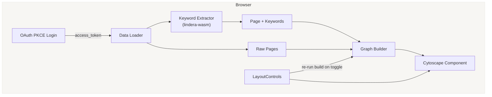

# Notion Graph – Architecture & Technical Design

## 1. Overview

Notion Graph is a **100 % client‑side** visualiser that converts any Notion database into an interactive knowledge map. The stack is deliberately lightweight to support static hosting (Vercel/CF Pages) while delivering rich UX:

| Layer        | Choice                               | Rationale                                                  |
| ------------ | ------------------------------------ | ---------------------------------------------------------- |
| UI / Routing | Next.js 14 App Router                | File‑based routing, React 18 streaming, easy Vercel deploy |
| Styling      | Tailwind CSS v4 (CSS‑first `@theme`) | Design tokens in CSS, no JS config                         |
| Graph        | Cytoscape.js + react‑cytoscapejs     | Mature API, rich layout ecosystem                          |
| NLP          | **lindera‑wasm** (IPADIC)            | Fast Japanese tokeniser in WebAssembly                     |
| Auth         | Notion OAuth 2.0 PKCE                | No secret on the server, serverless‑friendly               |
| Tests        | **Vitest** + Testing‑Library         | Fast HMR‑style watch, Jest‑API compatible                  |

---

## 2. High‑level Architecture



---

## 3. Directory Structure (excerpt)

```txt
app/
  page.tsx           # top page – DB selector, tag toggles
  oauth/
    callback/page.tsx
components/
  GraphView.tsx      # react‑cytoscape wrapper
  GraphPanel.tsx     # GraphView + controls
  LayoutControls.tsx
lib/
  keyword.ts         # lindera‑wasm wrapper ⭐
  graph.ts           # graph data builder ⭐
  notion/
    notionToken.ts   # localStorage helper
    notionDatabase.ts
    notionDbList.ts
    notionMeta.ts
public/
  notion-graph-icon.png
```

---

## 4. Data Flow Details

1. **Login**: PKCE flow → `access_token` saved to `localStorage` (`notionToken.ts`).
2. **Database query**: `/api/notion/list` (Next.js Route) fetches pages & multi‑select props.
3. **Keyword extraction** (`keyword.ts`)

   1. Normalise title → remove URLs, emojis, etc.
   2. Tokenise via lindera‑wasm (`TokenizerBuilder` – ipadic, lowercase).
   3. Stop‑word filter (`stopword` + custom).
   4. Frequency × length scoring → top *N* keywords.
4. **Graph construction** (`graph.ts`)

   * Nodes: `page`, `keyword`, `prop` (dynamic multi‑select value).
   * Edges: page → keyword, page → prop value.
   * Slug IDs keep Cytoscape id‑safe.
5. **Rendering**: `GraphView` feeds `[nodes, edges]` to Cytoscape.
6. **Interactions**: `LayoutControls` toggles labels, layouts, fit, and prop inclusion → triggers `buildGraph` re‑run.

---

## 5. Keyword Pipeline (lindera‑wasm)

```text
TokenizerBuilder
  ├─ dictionary : ipadic
  ├─ mode       : normal
  ├─ char‑filter: unicode_normalize(nfkc)
  └─ token‑filter: lowercase
```

*Initialization* happens once (singleton Promise) to avoid reloading WASM.

---

## 6. Graph Styling Rules

| Selector               | Theme token      | Purpose            |
| ---------------------- | ---------------- | ------------------ |
| `node[type="page"]`    | `bg-n-blue`      | Primary nodes      |
| `node[type="keyword"]` | `bg-n-yellow-bg` | NLP keywords       |
| `node[type="prop"]`    | `bg-n-green-bg`  | User‑selected tags |
| `edge`                 | `border-n-gray`  | Neutral lines      |

---

## 7. Testing Strategy

* **Unit**: `keyword.ts`, `graph.ts` – deterministic input/output.
* **Component**: GraphPanel toggles update Cytoscape elements.
* **E2E** (road‑map): Playwright login stub + DB fixture.

Run:

```bash
pnpm test          # vitest run
pnpm dev:test      # watch mode
```

Coverage target ≥ 90 % for core utils.

---

## 8. Deployment

1. **CI** (`ci.yml`) – type‑check, lint, test, build.
2. **Vercel** preview deploy on every PR.
3. **Production**: tag with `v*` → GitHub Action builds and releases.

---

## 9. Future Enhancements

* Dark‑mode palette via CSS variables.
* Graph export (PNG / JSON).
* Worker‑based keyword extraction for large datasets.
* Incremental Notion sync (Delta API when available).

---

> Maintainer: Ackkerman – feel free to open an issue or PR! 🚀
